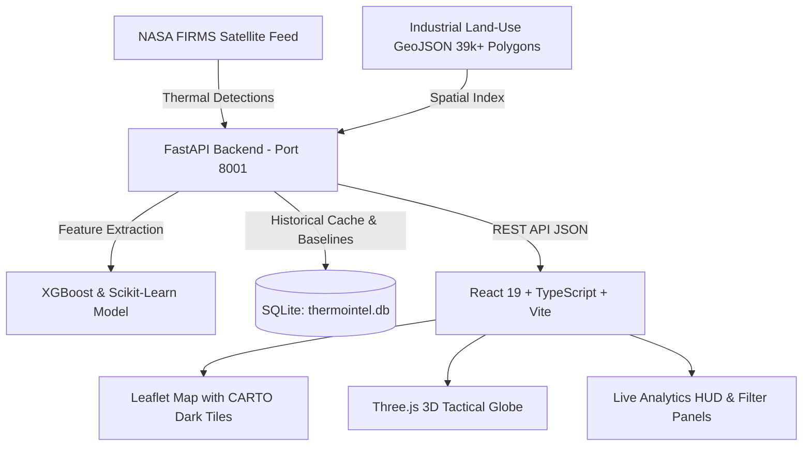

# ThermoIntel 🛰️🔥
### AI-Assisted Industrial Thermal Intelligence & Anomaly Monitoring Platform

[](https://fastapi.tiangolo.com)
[](https://react.dev/)
[](https://vitejs.dev/)
[](https://www.typescriptlang.org/)
[](https://xgboost.readthedocs.io/)
[](https://leafletjs.com/)
[](LICENSE)

---

## 📌 Overview

**ThermoIntel** is an end-to-end industrial thermal intelligence and monitoring platform built for **Smart India Hackathon (SIH 26162)**. The platform ingests near-real-time satellite thermal anomaly feeds from **NASA FIRMS** (VIIRS / MODIS) and combines geospatial indexing, spatial polygon intersections with over 39,000 industrial zones across India, and machine learning classification to distinguish routine industrial operations from hazardous thermal anomalies and industrial fire risks.

---

## 🚀 Key Features

- **Near-Real-Time Satellite Ingestion**: Continuously polls NASA FIRMS API for thermal detections across the Indian subcontinent.
- **Geospatial & Spatial Indexing**:
  - Spatial intersection against 39,000+ industrial land-use polygons in India.
  - Spatial point-in-polygon and buffer queries using Shapely and grid-indexed spatial boundaries.
  - Country boundary clipping via GeoJSON to filter out international noise.
- **Hybrid Intelligence Scoring & ML Classification**:
  - **XGBoost & Scikit-Learn Classifier**: Classifies detections into *Potential Industrial Thermal Source*, *Thermal Anomaly*, or *Industrial Fire Candidate*.
  - Multi-factor risk engine computing an **Intelligence Score** (0–100) based on Fire Radiative Power (FRP), brightness temperature, confidence, persistence, and land-use context.
- **Persistent Thermal Source Detection**:
  - Tracks thermal recurring baselines to identify stationary industrial heat emitters (e.g., steel furnaces, refineries, flare stacks, cement kilns).
- **Dual-View Operational Interface**:
  - **3D Tactical Globe**: Interactive Three.js globe visualizing global and regional thermal hotspots.
  - **Full-Bleed 2D High-Resolution Map**: Interactive Leaflet workstation powered by CARTO dark basemaps with dynamic hotspot markers scaled by FRP.
- **Comprehensive Analytics HUD**:
  - 14-day temporal trend charts.
  - Severity level filters (Critical, High, Medium, Low) and keyword search.
  - Real-time telemetry cards with average intelligence score and active source counts.
- **Industrial Proximity Inspector**:
  - Detailed side drawer showing distance to closest industrial parks, coordinates, satellite sensor, brightness, and raw telemetry.

---

## 🏗️ Architecture



---

## 🗂️ Project Structure

```text
thermointel/
├── .env.example                # Sample frontend environment file
├── .gitignore                  # Git ignore rules (protects API keys, DBs, models)
├── index.html                  # HTML entry point
├── package.json                # Frontend dependencies and npm scripts
├── tsconfig.json               # TypeScript configuration
├── vite.config.ts              # Vite configuration
│
├── src/                        # Frontend source code
│   ├── App.tsx                 # Main workstation UI, HUD, Leaflet map, and analytics
│   ├── Globe3D.tsx             # Interactive Three.js 3D globe component
│   ├── app.css                 # Dark-mode styling, glassmorphism, and HUD styles
│   ├── main.tsx                # React DOM root entry
│   └── index.css               # Global base styles
│
└── backend/                    # FastAPI backend
    ├── .env.example            # Sample backend environment file
    ├── requirements.txt        # Python dependencies (FastAPI, Shapely, XGBoost, etc.)
    └── app/
        ├── main.py             # FastAPI entrypoint, spatial filters, and REST endpoints
        ├── db.py               # SQLite database layer for persistence and baselines
        ├── ml_features.py      # Feature engineering pipeline for ML model
        ├── train_model.py      # Script to train/retrain the XGBoost classifier
        ├── india.geojson       # India national boundary for spatial clipping
        ├── industrial_landuse.geojson  # 39,280 industrial land-use polygons
        └── models/
            ├── thermal_classifier.joblib  # Pre-trained XGBoost classification model
            └── label_encoder.joblib       # Label encoder for target classes
```

---

## ⚙️ Environment Configuration

Environment secrets are kept strictly isolated and are ignored by version control. Template files are provided for setup.

### 1. Root `.env` (Frontend)

Create a `.env` file in the root directory (or copy from `.env.example`):

```env
# Optional: CARTO Basemap key (basemap functions with or without key)
VITE_CARTO_API_KEY=your_carto_api_key_here

# Backend API URL (default: http://127.0.0.1:8001)
VITE_API_URL=http://127.0.0.1:8001
```

### 2. Backend `backend/.env` (Backend)

Create a `.env` file in the `backend/` directory (or copy from `backend/.env.example`):

```env
# Required: NASA FIRMS Map Key
# Get a free key at: https://firms.modaps.eosdis.nasa.gov/api/map_key
FIRMS_MAP_KEY=your_nasa_firms_map_key_here
```

---

## 🛠️ Getting Started

### Prerequisites

- **Node.js**: `v18+` (v20+ recommended)
- **Python**: `v3.10+` (tested on Python 3.13)
- **NASA FIRMS MAP KEY**: Free registration from [NASA FIRMS API](https://firms.modaps.eosdis.nasa.gov/api/map_key)

---

### Step 1: Backend Setup

1. Open a terminal and navigate to the `backend` folder:
   ```bash
   cd backend
   ```

2. Create and activate a Python virtual environment:
   ```bash
   # Windows PowerShell
   python -m venv .venv
   .\.venv\Scripts\Activate.ps1

   # Linux / macOS
   python3 -m venv .venv
   source .venv/bin/activate
   ```

3. Install required Python packages:
   ```bash
   pip install -r requirements.txt
   ```

4. Create your `backend/.env` file:
   ```bash
   cp .env.example .env
   ```
   Add your `FIRMS_MAP_KEY` inside `backend/.env`.

5. (Optional) Train / retrain the classifier model:
   ```bash
   python app/train_model.py
   ```

6. Start the FastAPI server:
   ```bash
   uvicorn app.main:app --reload --port 8001
   ```
   The backend API will be live at: **`http://127.0.0.1:8001`**  
   Interactive Swagger docs at: **`http://127.0.0.1:8001/docs`**

---

### Step 2: Frontend Setup

1. Open a second terminal in the project root:
   ```bash
   cd thermointel
   ```

2. Install Node dependencies:
   ```bash
   npm install
   ```

3. Create your `.env` file (optional, defaults connect to `http://127.0.0.1:8001`):
   ```bash
   cp .env.example .env
   ```

4. Run the frontend development server:
   ```bash
   npm run dev
   ```
   The application will be accessible at: **`http://localhost:5173`**

---

### 🚀 Deploying Frontend to Vercel

The repository includes a ready-to-use [`vercel.json`](file:///vercel.json) pre-configured for Vite:

1. **Via Vercel CLI (Manual Deployment)**:
   ```bash
   npx vercel
   # For production release:
   npx vercel --prod
   ```

2. **Via Vercel Web Dashboard**:
   - Import your GitHub repository (`mukulmehta-dev/Thermointel`).
   - Framework preset will automatically be detected as **Vite**.
   - Build Command: `npm run build`
   - Output Directory: `dist`

3. **Configure Environment Variables in Vercel**:
   Add the following in your Vercel Project Settings -> **Environment Variables**:
   - `VITE_API_URL`: URL of your deployed FastAPI backend (e.g. `https://your-backend.onrender.com`)
   - `VITE_CARTO_API_KEY`: *(Optional)* Your CARTO basemaps key

---

## 📡 API Reference

The FastAPI backend provides the following REST API endpoints:

| Method | Endpoint | Description |
|---|---|---|
| `GET` | `/api/health` | Service health status, database connection, and FIRMS key check |
| `GET` | `/api/firms/events` | Retrieves processed thermal events with ML classification and scores |
| `GET` | `/api/firms/clusters` | Spatial clustering of nearby thermal anomalies |
| `GET` | `/api/firms/context` | Proximity check against nearest industrial polygons (`latitude`, `longitude`, `radius_km`) |
| `GET` | `/api/firms/persistent` | List of recurring thermal sources active across multiple days |
| `GET` | `/api/firms/trends` | 14-day aggregate event volume and intelligence score trends |
| `GET` | `/docs` | Interactive OpenAPI / Swagger UI documentation |

---

## 🧪 Testing & Validation

Run quality and validation checks across both tiers:

```bash
# Frontend Typecheck & Production Build
npm run build

# Frontend Linter
npm run lint

# Backend Model Training & Validation
cd backend
python app/train_model.py
```

---

## 🔒 Security & Privacy

- All `.env` files, API keys, and local SQLite databases are strictly excluded via [`.gitignore`](file:///.gitignore).
- Sensitive environment configurations are loaded safely via `python-dotenv` with automatic path fallback.
- Never commit active API keys to public version control.

---

## 📄 License

This project is licensed under the MIT License.
